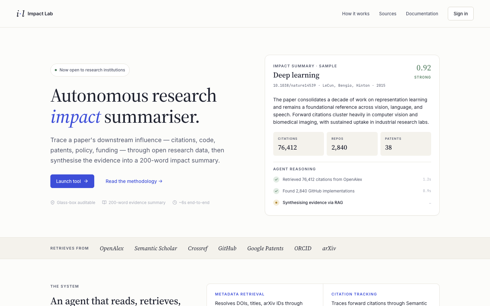
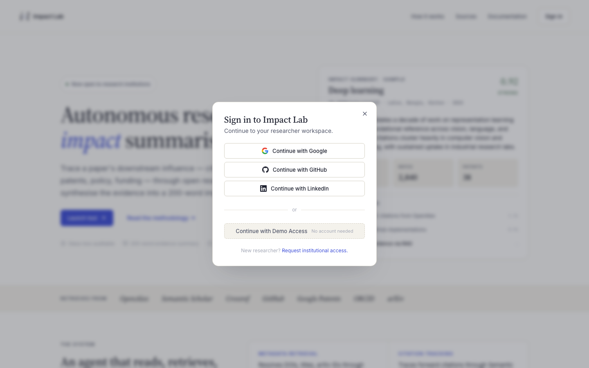
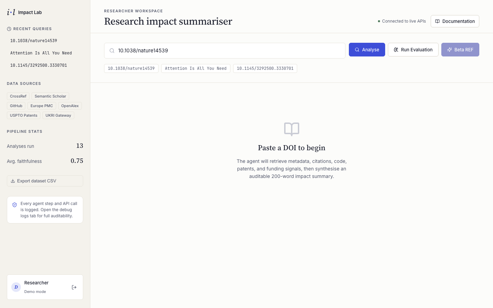
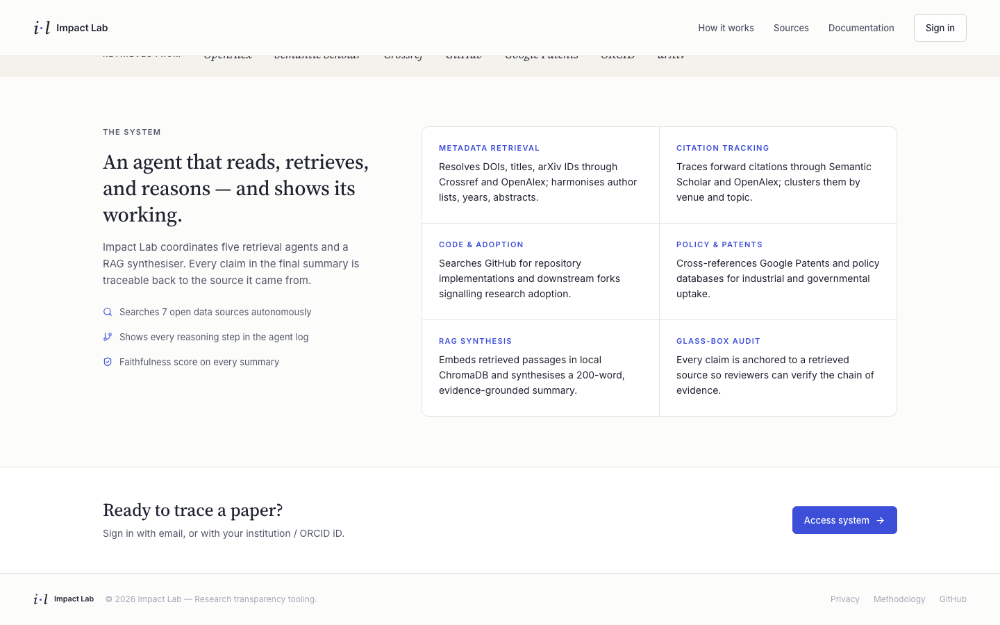

# Impact Lab — Autonomous Research Impact Summariser

> Trace a paper's downstream influence — citations, code, patents, policy, funding — through open research data, then synthesise the evidence into a 200-word auditable impact summary.

[](https://www.python.org/)
[](https://fastapi.tiangolo.com/)
[](https://react.dev/)
[](https://github.com/langchain-ai/langgraph)
[](https://deepmind.google/technologies/gemini/)
[](LICENSE)

---

## Screenshots

### Landing Page


### Sign In Modal


### Researcher Dashboard


### Capabilities


---

## What It Does

Impact Lab is a **multi-agent AI pipeline** that autonomously traces a research paper's real-world impact:

| Step | What happens |
|---|---|
| **1. Resolve** | Accepts DOI, arXiv ID, paper title, or BibTeX — resolves to canonical metadata via CrossRef |
| **2. Retrieve** | 6 parallel agents fetch evidence from 7 open APIs (citations, code repos, patents, policy, funding) |
| **3. Index** | All evidence is embedded and stored in ChromaDB (sentence-transformers or hash fallback) |
| **4. Synthesise** | RAG retrieves top-6 relevant chunks → Gemini 2.5 Flash writes a grounded 200-word narrative |
| **5. Evaluate** | A second LLM call scores faithfulness (0–1) against the evidence |
| **6. Audit** | Every agent step, API call, and evidence source is logged and shown in the UI |

---

## Features

- **6-tab dashboard** — Overview · Evidence · REF Report · Debug Logs · Evaluation · Beta REF 2029
- **Glass-box auditability** — full agent log, every source URL, faithfulness score on every summary
- **Agentic vs Baseline evaluation** — compare the multi-agent pipeline against a naive CrossRef-only baseline
- **Beta REF 2029 writer** — generates a full UK Research Excellence Framework impact case study (~2000 words) with an auditor agent that flags unverified claims
- **Author identity verification** — fuzzy name matching to confirm paper authorship before REF generation
- **Multi-auth** — Google, GitHub, LinkedIn OAuth + Demo Access (no account needed)
- **Export** — download all analyses as CSV dataset

---

## Data Sources

| Source | What it provides |
|---|---|
| CrossRef | Paper metadata, abstract, authors, DOI resolution |
| OpenAlex | Citation counts, topic labels, institutional affiliations |
| Semantic Scholar | Citation graph, highly-cited downstream papers |
| GitHub | Code repositories implementing the paper |
| Google Patents | Patent cross-references |
| Europe PMC | Policy document mentions |
| UKRI Gateway | UK research grant funding signals |

---

## Tech Stack

**Backend**
- [FastAPI](https://fastapi.tiangolo.com/) — async REST API
- [LangGraph](https://github.com/langchain-ai/langgraph) — multi-agent state machine orchestration
- [ChromaDB](https://www.trychroma.com/) — local vector store for RAG
- [sentence-transformers](https://sbert.net/) — `all-MiniLM-L6-v2` embeddings
- [Gemini 2.5 Flash](https://deepmind.google/technologies/gemini/) — LLM synthesis + faithfulness scoring
- [SQLite](https://www.sqlite.org/) — persistent analysis & evaluation history
- [PyJWT](https://pyjwt.readthedocs.io/) — LinkedIn OAuth token signing

**Frontend**
- [React 18](https://react.dev/) + [TypeScript](https://www.typescriptlang.org/)
- [Vite](https://vitejs.dev/) — fast dev server + build
- [React Router v7](https://reactrouter.com/) — SPA routing
- [Firebase](https://firebase.google.com/) — Google / GitHub OAuth
- [Lucide React](https://lucide.dev/) — icon library
- **Impact Lab Design System** — Source Serif 4 · Inter · JetBrains Mono · white academic aesthetic

---

## Run Locally

### Prerequisites

- Python 3.11+
- Node.js 18+
- A free [Google AI Studio](https://aistudio.google.com/) API key (Gemini)

### Backend

```bash
cd backend
python3 -m venv .venv
source .venv/bin/activate
pip install -r requirements.txt
```

Create `backend/.env`:

```env
GOOGLE_API_KEY=your_gemini_api_key_here
DEMO_MODE=true
ALLOWED_ORIGINS=http://localhost:5173
```

Start the server:

```bash
uvicorn app.main:app --reload --port 8000
```

### Frontend

```bash
cd frontend
npm install
npm run dev
```

Open [http://localhost:5173](http://localhost:5173) — click **Continue with Demo Access** to enter without an account.

---

## API Endpoints

| Method | Endpoint | Description |
|---|---|---|
| `GET` | `/health` | Liveness check |
| `GET` | `/api/search?q=` | Search for papers (returns candidates) |
| `POST` | `/api/analyze` | Full multi-agent pipeline |
| `POST` | `/api/evaluate` | Agentic vs baseline comparison |
| `POST` | `/api/ref/beta` | Generate REF 2029 case study |
| `GET` | `/api/stats` | Total analyses, avg faithfulness |
| `GET` | `/api/dataset?fmt=csv` | Export all analyses as CSV |
| `GET` | `/api/history` | User query history (auth required) |

---

## Sample Papers to Test

| Paper | Input |
|---|---|
| Attention Is All You Need | `Attention Is All You Need` |
| Deep learning (LeCun et al.) | `10.1038/nature14539` |
| AlphaFold | `10.1038/s41586-021-03819-2` |
| BERT | `10.18653/v1/N19-1423` |
| LIGO Gravitational Waves | `10.1103/PhysRevLett.116.061102` |
| CRISPR-Cas9 | `10.1126/science.1225829` |

---

## Project Structure

```
├── backend/
│   ├── app/
│   │   ├── main.py           # API routes, CORS, rate limiting
│   │   ├── models.py         # Pydantic data schemas
│   │   ├── services.py       # LangGraph multi-agent pipeline
│   │   ├── rag.py            # ChromaDB vector store + embeddings
│   │   ├── hf_synthesis.py   # Gemini LLM interface
│   │   ├── evaluation.py     # Agentic vs baseline comparison
│   │   ├── ref_beta.py       # REF 2029 writer + auditor agents
│   │   ├── database.py       # SQLite persistence
│   │   ├── access_guard.py   # Author identity verification
│   │   ├── auth.py           # Firebase JWT + LinkedIn OAuth
│   │   └── validation.py     # Input sanitisation
│   └── requirements.txt
│
├── frontend/
│   └── src/
│       ├── Dashboard.tsx     # Main 6-tab application
│       ├── LandingPage.tsx   # Marketing page
│       ├── LoginModal.tsx    # Auth modal
│       ├── AuthContext.tsx   # Global auth state
│       └── styles.css        # Impact Lab design system
│
└── docs/
    ├── REVERSE_ENGINEERING.md   # Complete system walkthrough
    ├── HLD.md                   # High-level design
    ├── LLD.md                   # Low-level design
    └── SRS.md                   # Software requirements spec
```

---

## Security

- Input sanitisation blocks SQL injection, XSS, path traversal, and code injection patterns
- Per-IP sliding window rate limiting on every endpoint
- CORS restricted to configured origins
- API keys stored in `.env`, never exposed to the browser
- Author verification before REF case study generation

---

## Documentation

Full technical documentation is in [`docs/REVERSE_ENGINEERING.md`](docs/REVERSE_ENGINEERING.md) — covers every file, the complete data flow, all design decisions, and likely supervisor questions with answers.

---

## Contributing

1. Fork the repository and create a feature branch
2. Install dependencies as described in **Run Locally**
3. Run tests: `pytest` (backend) · `npm test` (frontend)
4. Submit a pull request

---

*Built for research transparency — every claim is traceable to its source.*
